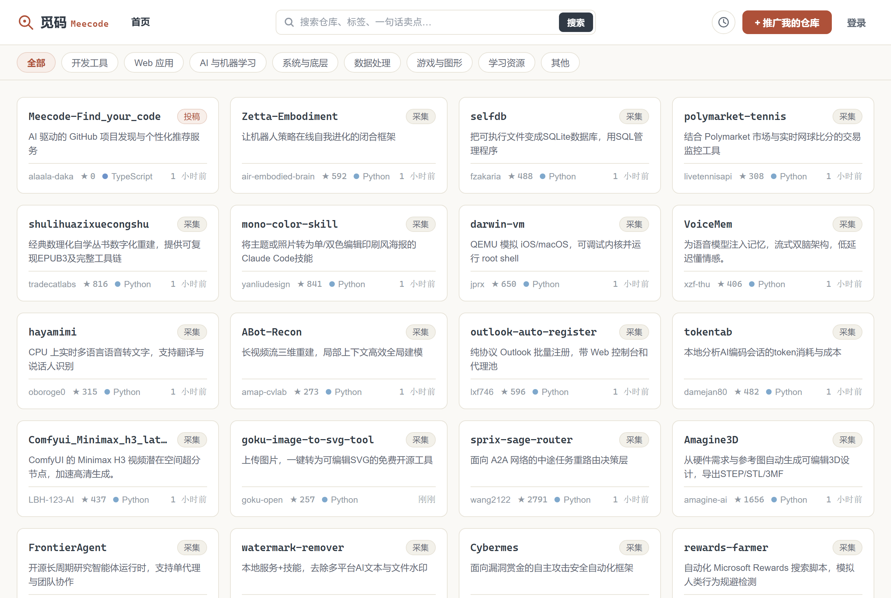
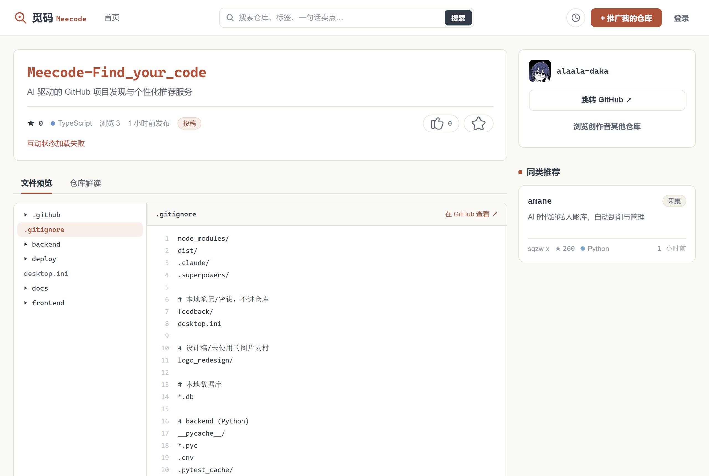
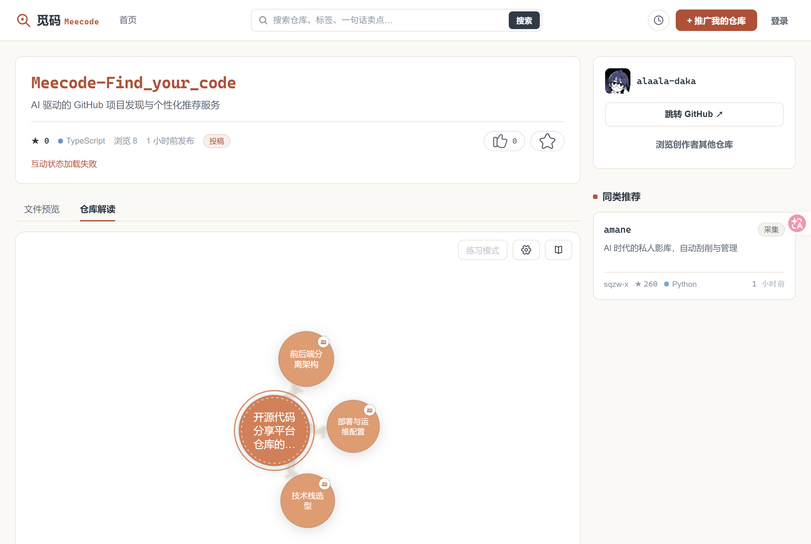
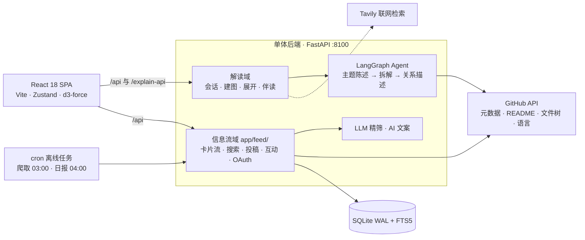

<div align="center">
  
</div>

# 觅码 · Meecode

> GitHub 之上的曝光层与中文解读层 —— 代码留在 GitHub，觅码只做曝光。

<div align="center">

[](https://www.meecode.tech)
[](backend/requirements.txt)
[](backend/requirements.txt)
[](frontend/package.json)
[](frontend/package.json)
[](backend/app/feed/db.py)

**[在线体验 →](https://www.meecode.tech)**

</div>

---

## 这是什么

觅码给想推广自己仓库的作者提供曝光途径，也给读者提供一套中文的仓库理解工具：

- **作者投稿**：GitHub OAuth 登录 → 勾选自己的仓库 → 「AI 帮我写」生成中文卖点草稿 → 发布，即获得 **72 小时首发加权窗口**与首页**保底预留位**；
- **平台采集**：定时爬取 GitHub 新仓库，经规则粗筛 + LLM 精筛发掘无名潜力创作者（followers < 500 的启发式，专门绕开明星项目）；
- **仓库解读**：任何收录仓库都能一键生成**概念发散图**——AI 通读仓库（元信息 / README / 文件树 / 语言统计）后自动建图，点击节点逐层展开，双击节点出精读长文，边读边追问（联网检索，流式回答）。

觅码**不托管代码**：不 clone、不存仓库文件，文件预览实时走 GitHub API。任何需要存代码或管权限的方案，一律出局。

## 界面速览

| 卡片流首页 | 仓库页 · 文件预览 | 仓库解读 · 概念图 |
|---|---|---|
|  |  |  |
| 8 大分类，投稿保底曝光 | 实时走 GitHub API，不落盘 | 点击展开，双击精读 |

## 功能特性

**发现与浏览**
- 卡片流首页：规则排序（新鲜度半衰期 72h + 首发加权 + 质量分），每页为投稿保留 40% 预留位
- 全文搜索：SQLite FTS5（bm25 相关度 / 最新 / 星数三种排序），短词自动回退 LIKE
- 仓库详情：README 消毒渲染、嵌套文件树与代码预览（GitHub API 实时代理 + 缓存）、同类推荐
- 互动与个人主页：点赞 / 收藏 / 浏览计数（幂等并发安全），公开档案页，浏览历史仅本人可见

**仓库解读（AI）**
- 以仓库为根自动建图：后端拉取「仓库理解包」→ LangGraph 生成主题陈述 → 自动首层展开
- 节点展开：单次 2–6 个、最高层数可调，标注 concept / category / dimension 类型与相关度
- 双向关系：点击边查看父→子 / 子→父 的双向描述，聚焦概念区别
- 阅读器伴读：双击节点出 300–500 字 Markdown 精读，追问走 NDJSON 流式 + Tavily 联网检索
- 练习模式：保留探索轨迹、抹去节点正文，按路径主动回忆
- 设置区：单次展开数、最高层数、生成/伴读模型覆盖、Tavily 密钥，localStorage 持久化即时生效

**投稿与采集**
- 投稿不设质量门：LLM 评分只影响排序不作准入，新人的第一个项目也能拿到首发曝光
- 「AI 帮我写」：LLM 生成中文卖点草稿，作者可改后发布
- 采集管道与 Web 请求完全解耦：日配额 30 条封顶，规则粗筛后仅对 top-K 做 LLM 精筛，花销可预算
- 每轮补筛「质量待定」仓库，曝光合规日报量化保底承诺兑现情况

## 设计理念

<div align="center">
  
</div>

1. **代码留在 GitHub。** 觅码只存元数据、README、AI 解读与互动数据；文件预览实时代理，零图片存储（封面由前端模板实时渲染）。
2. **两条入口，两套规则。** 投稿是第一目的：不设 star / 粉丝 / 质量门，只卡滥用底线；采集是第二目的：followers < 500 等启发式专为发掘无名者，且以日配额、首发加权、预留位三重机制保证采集不冲淡投稿。
3. **曝光是承诺，不是概率。** 投稿发布后 72 小时内排序加权 ×3；首页每页 40% 预留位保底；达标率由日报监控，掉到 50% 以下即上调预留位比例。
4. **纸面墨线。** 纸白底 + 墨色文字 + 单一暖色强调 + 发丝线边框；仓库与路径一律等宽字——「仓库名即代码」。克制的静界面，动效只出现在画布内。
5. **离线优先。** `LLM_MOCK` / `GITHUB_MOCK` / `VITE_USE_MOCK` 三层开关，不配任何 key 即可完整跑通开发与测试；生产模式漏配 `SESSION_SECRET` 则拒绝启动（fail-fast）。

## 架构



解读域的「仓库理解包」住在前端会话里，后续展开 / 精读 / 追问的每次 prompt 都注入仓库上下文——解读贴合仓库实际模块与技术栈，不空谈通用知识。会话仅存进程内存，不落库；信息流域持久化到 SQLite（WAL 读写不互斥 + 每请求连接 + busy_timeout）。

```
backend/
  app/
    main.py            # FastAPI 入口：解读路由 + feed.routes.* 挂载于 /api
    config.py          # 全部环境变量与可调参数（排序、配额、粗筛门槛、分类枚举）
    gh.py, llm.py      # GitHub 理解包拉取 / OpenAI 兼容流式客户端
    agent/             # LangGraph：建图、展开、精读、伴读、联网检索、mock
    feed/              # 信息流域：db/auth/github/cards/ranking/screening
      routes/          # feed · repos · submit · me · users
      jobs/            # crawl.py 每日采集 · report.py 曝光日报
  tests/               # 测试模块：筛选、排序、预留位、并发竞态回归、契约形状
frontend/
  src/
    pages/             # Home · Search · Repo · Submit · Profile
    explain/           # 解读画布：graph 引擎（d3-force 六文件）· 阅读器 · 设置
    api/               # ApiClient 接口 + mock/real 双实现，VITE_USE_MOCK 分流
    components/        # 卡片、文件树、TopBar、登录弹窗等
deploy/               # systemd 单元 + Nginx 模板
docs/                 # 设计文档（specs/plans）+ 部署 Runbook
```

| 层 | 选型 | 说明 |
|---|---|---|
| 前端 | React 18 · TypeScript · Vite · Zustand | 图谱引擎 d3-force/drag/zoom，Markdown 渲染 react-markdown + sanitize |
| 后端 | FastAPI · LangGraph · httpx | OpenAI 兼容 SDK 接任意服务商，默认 DeepSeek |
| 数据 | SQLite（WAL + FTS5） | 单机 MVP 足够，扛不住再换 Postgres |
| 登录 | GitHub OAuth | 登录态是 HMAC 签名 cookie，**access token 用完即弃，不落库** |

## 快速开始

### 后端（端口 8100）

```bash
cd backend
python3 -m venv .venv
.venv/bin/pip install -r requirements.txt   # Windows: .venv\Scripts\pip install -r requirements.txt
cp .env.example .env                        # Windows: copy .env.example .env
uvicorn app.main:app --port 8100
```

`.env.example` 默认全 mock——**不填任何 key 即可离线启动**。健康检查：`curl http://127.0.0.1:8100/api/health`。

### 前端（端口 5173）

```bash
cd frontend
npm install
npm run dev
```

打开 http://localhost:5173 ，`/api` 与 `/explain-api` 已由 Vite 代理到 8100。

### 离线灌入演示数据

```bash
cd backend
python -m app.feed.jobs.crawl    # 走 mock 爬取 + 精筛，灌入采集卡片
python -m app.feed.jobs.report   # 输出投稿保底曝光达标率日报
```

### 接入真实服务

在 `backend/.env` 填入 `LLM_API_KEY`（OpenAI 兼容）、`GITHUB_TOKEN`、`TAVILY_API_KEY`，并将 `LLM_MOCK` / `GITHUB_MOCK` 置为 `false`；前端 `VITE_USE_MOCK=false` 切到真实客户端。生产模式（`GITHUB_MOCK=false`）必须设置 `SESSION_SECRET`，否则后端拒绝启动。

## 环境变量（backend/.env）

| 变量 | 默认 | 说明 |
|---|---|---|
| `LLM_BASE_URL` | `https://api.deepseek.com` | OpenAI 兼容接口地址 |
| `LLM_API_KEY` | — | 解读与精筛共用 |
| `LLM_MODEL` | `deepseek-chat` | 模型名 |
| `LLM_MOCK` | `true` | 不调真实 LLM，返回确定性演示数据 |
| `TAVILY_API_KEY` | — | 伴读联网检索（也可在解读设置区按会话覆盖） |
| `GITHUB_TOKEN` | — | 平台 token：读公开信息 + 爬取配额 5000/h |
| `GITHUB_CLIENT_ID` / `_SECRET` | — | OAuth 登录（callback：`https://<domain>/api/auth/callback`） |
| `GITHUB_MOCK` | `true` | 不访问真实 GitHub；生产必须 `false` |
| `SESSION_SECRET` | 仅开发默认值 | 签名 cookie 密钥，**生产必填** |
| `FRONTEND_ORIGIN` | `http://localhost:5173` | CORS 白名单与 OAuth 回跳来源 |
| `DB_PATH` | `meecode.db` | SQLite 路径 |

## 测试

```bash
cd backend  && pytest          # 筛选、排序、预留位、并发竞态回归、API 契约形状
cd frontend && npm test        # 组件、store、mock/real 客户端契约映射
cd frontend && npm run typecheck
```

## 部署

生产形态：**Nginx（静态前端 + 反向代理 /api）+ systemd（uvicorn :8100）+ GitHub Actions 自动部署**。

- 推送到部署分支即自动：构建前端（`VITE_USE_MOCK=false`）→ rsync `dist/` → 服务器 `git pull` + 装依赖 → 重启 systemd → 健康检查
- 服务器一次性初始化（deploy 用户、SSH 密钥、证书、OAuth App、cron）见 **[docs/deploy-runbook.md](docs/deploy-runbook.md)**，回滚与排障速查同文档
- 定时任务（deploy 用户 crontab）：

```cron
0 3 * * * cd /opt/meecode/backend && .venv/bin/python -m app.feed.jobs.crawl  >> /var/log/meecode-crawl.log 2>&1
0 4 * * * cd /opt/meecode/backend && .venv/bin/python -m app.feed.jobs.report >> /var/log/meecode-report.log 2>&1
```

## 可调参数

排序权重、首发窗口、预留位比例、采集配额、粗筛门槛（README 长度 / 代码文件数 / star 增速 / followers 上限）、分类枚举，全部集中在 [`backend/app/config.py`](backend/app/config.py)，改完冷启动生效。`report` 日报的达标率跌破 50%，即为上调 `RESERVED_RATIO` 的信号。

## 项目文档

- [docs/deploy-runbook.md](docs/deploy-runbook.md) — 服务器初始化、CI 部署、回滚、排障
- [docs/superpowers/specs/](docs/superpowers/specs/) — 各子项目设计文档（收录与浏览、UI 规范、仓库解读、线上部署、信息流全链路）
- [docs/superpowers/plans/](docs/superpowers/plans/) — 对应实现计划

---

<div align="center">
<strong>觅码 · 发现潜力开源仓库，让好代码被看见。</strong><br>
<a href="https://www.meecode.tech">www.meecode.tech</a>
</div>
